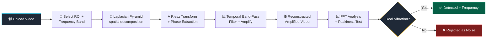
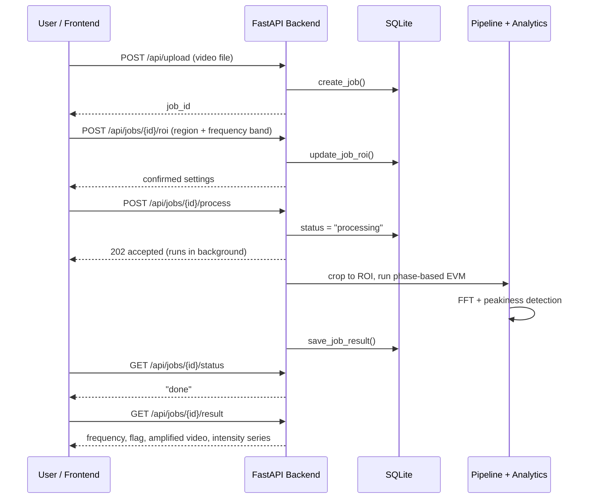

<div align="center">

# 🎯 Motion Amplification Video Analysis System

[](https://git.io/typing-svg)


**Making invisible vibrations visible — and proving they're real, not noise.**

</div>

---

## 📖 Table of Contents

- [What This Project Does](#-what-this-project-does)
- [The Problem It Solves](#-the-problem-it-solves)
- [How It Works](#-how-it-works)
- [Technical Deep Dive](#-technical-deep-dive)
- [Tech Stack](#️-tech-stack)
- [Project Structure](#-project-structure)
- [Getting Started](#-getting-started)
- [API Reference](#-api-reference)
- [Validation Results](#-validation--real-end-to-end-test-results)
- [Known Limitations](#️-known-limitations)
- [Roadmap](#️-roadmap)
- [FAQ / Judge Q&A](#-faq--anticipated-questions)
- [Team & Development Notes](#-team--development-notes)

---

## 📖 What This Project Does

Some vibrations are too small to see with the naked eye — a sub-pixel flutter
on a panel, an engine housing, a structural joint. This system takes ordinary
video, **amplifies motion that's otherwise invisible**, and then
**mathematically verifies** whether what it found is a genuine, periodic
vibration — not just camera shake, sensor noise, or a coincidence.

It uses **phase-based Eulerian Video Magnification** (the same family of
technique developed at MIT) combined with **FFT-based frequency analysis**
and a statistical peak-detection test, so the system doesn't just show you
*something moved* — it tells you *whether that motion is real, and at what
frequency.*

---

## 🎯 The Problem It Solves

Vibration analysis usually needs physical sensors (accelerometers,
laser vibrometers) mounted directly on whatever you're monitoring — not
always practical, safe, or possible at a distance. This system instead
works from **video alone**, making it useful anywhere a camera can see but
a sensor can't easily be attached:

- Detecting hidden mechanical activity (engines, motors) from footage
- Monitoring structural flex/fatigue on panels or housings over time
- Surveillance and decision-support scenarios where physical access is limited

The system is built around two honest, hard-won design principles from our
own testing (see [Validation Results](#-validation--real-end-to-end-test-results)):
**amplitude alone is not proof of a real signal**, and **frequency alone is
not proof of a real signal either** — both can be fooled by noise. Only a
combination of *targeted frequency filtering* and a *statistical sharpness
test* reliably tells real vibration apart from noise, which is why both are
built into the core detection logic, not bolted on as an afterthought.

---

## 🧠 How It Works



### Request flow, end to end



---

## 🔬 Technical Deep Dive

<details>
<summary><b>Click to expand — the actual math and reasoning behind each step</b></summary>

### 1. Eulerian vs. Lagrangian motion analysis
Instead of tracking moving objects (Lagrangian, like optical flow — struggles
with sub-pixel motion), we watch **fixed pixel locations over time**
(Eulerian) — turning "detect motion" into "analyze a time-series signal,"
which lets us borrow well-established audio-style signal processing tools.

### 2. Laplacian pyramid (spatial decomposition)
Each frame is broken into layers of detail, fine to coarse, by repeatedly
blurring and shrinking (Gaussian pyramid), then storing the *difference*
between consecutive levels (Laplacian pyramid). This lets vibration at
different spatial scales be amplified independently, and is fully
reversible — build then collapse reproduces the original frame exactly
(verified: 0.0 reconstruction error in testing).

### 3. Riesz transform + phase extraction
A single pixel value alone can't express *position* as a clean angle — you
need a quadrature pair (like `cos`/`sin`). The Riesz transform manufactures
that second value from a single image, letting us compute a true **phase**
per pixel — which shifts cleanly and reliably with real sub-pixel motion,
unlike raw brightness, which conflates motion with lighting/noise.

### 4. Temporal band-pass filtering
Every pixel's value (or phase) over time is a signal, exactly like audio.
A zero-phase Butterworth filter (`sosfiltfilt`) keeps only a chosen
frequency range and removes drift/noise — without introducing a time-shift
that would misalign the filtered signal when added back to the original.

### 5. FFT-based detection with statistical peakiness
Raw FFT tells you the strongest frequency present — but noise always has
*some* frequency that looks tallest, purely by chance (the "look-elsewhere
effect"). We compute a **z-score**: how many standard deviations above the
typical background level the peak sits, with the peak's own neighborhood
excluded from that background estimate. Only a statistically sharp,
genuine spike counts as a detection.

### Real bugs found and fixed during development
- **Video compression can destroy sub-pixel signals** — lossy `.mp4`
  encoding introduced its own periodic artifact strong enough to bury a
  real 0.3px vibration. Confirmed by comparing against lossless `.npy`
  ground-truth data.
- **Whole-frame analysis dilutes localized signals** — averaging motion
  over an entire frame buries a small, real, localized vibration in noise
  from unrelated static regions. A properly chosen ROI is functionally
  necessary, not optional.
- **The look-elsewhere effect caused false positives** — picking the
  tallest frequency out of many bins will always look "unusual" in pure
  noise. Fixed with a peakiness threshold calibrated against real
  negative-control test data (44.2 for real signal vs. under 4 for noise).

Full write-up: [`docs/build_log_and_findings.md`](docs/build_log_and_findings.md)

</details>

---

## 🛠️ Tech Stack

| Layer | Technology | Why |
|---|---|---|
| Core algorithm | Python, NumPy, OpenCV, SciPy | Fast array math, image pyramids, and trusted, well-tested signal filtering (Butterworth/FFT) |
| Backend API | FastAPI, Uvicorn | Async-friendly, auto-generates interactive API docs, minimal boilerplate |
| Storage | SQLite (`sqlite3`, no ORM) | Lightweight, zero-config, sufficient for a job/results table at this scale |
| Frontend | React *(in progress)* | Upload UI, ROI drawing, results dashboard |

---

## 📁 Project Structure

```
motion-amp-sih/
├── backend/
│   ├── requirements.txt
│   └── app/
│       ├── main.py              # FastAPI app — all API endpoints
│       ├── config.py            # frequency presets, alpha limits, folders
│       ├── db.py                # SQLite storage layer
│       ├── core/
│       │   ├── pyramid.py       # Laplacian pyramid (spatial decomposition)
│       │   ├── bandpass.py      # Butterworth temporal filter
│       │   ├── riesz.py         # Riesz transform pair
│       │   ├── phase.py         # phase/amplitude extraction
│       │   └── pipeline.py      # baseline + phase-based EVM, wired together
│       ├── io/
│       │   └── video_io.py      # video file <-> NumPy array
│       └── analytics/
│           └── vibration.py     # FFT vibration detection + peakiness test
├── test_clips/
│   └── generate_test_clips.py   # synthetic ground-truth test videos
├── docs/
│   └── build_log_and_findings.md
└── frontend/                    # React UI (in progress)
```

---

## 🚀 Getting Started

### 1. Clone and set up a virtual environment
```bash
cd motion-amp-sih/backend
python -m venv venv

# Windows
venv\Scripts\activate
# Mac/Linux
source venv/bin/activate
```

### 2. Install dependencies
```bash
pip install -r requirements.txt
```

### 3. Generate test clips (synthetic, known ground-truth videos)
```bash
cd ../test_clips
python generate_test_clips.py
```
Produces three clips: `vibrating_panel.mp4` (a real, known 15 Hz vibration
baked in), `static_panel.mp4` (no motion), and `camera_shake.mp4` (random,
non-periodic jitter) — used throughout development to validate detection.

### 4. Start the backend server
```bash
cd ../backend
uvicorn app.main:app --reload
```
Server runs at `http://127.0.0.1:8000`. Interactive API docs (auto-generated
by FastAPI): `http://127.0.0.1:8000/docs`.

---

## 📡 API Reference

| Method | Endpoint | Purpose |
|---|---|---|
| `GET` | `/` | Health check |
| `POST` | `/api/upload` | Upload a video, creates a new job |
| `POST` | `/api/jobs/{job_id}/roi` | Submit region-of-interest + frequency band |
| `POST` | `/api/jobs/{job_id}/process` | Start processing (runs in background) |
| `GET` | `/api/jobs/{job_id}/status` | Check job status |
| `GET` | `/api/jobs/{job_id}/result` | Get final analysis result |
| `GET` | `/api/jobs` | List all jobs |

### Example: full workflow
```bash
# 1. Upload
curl -X POST "http://127.0.0.1:8000/api/upload" \
  -F "file=@../test_clips/vibrating_panel.mp4"
# -> {"job_id": "a897b7e5-...", "filename": "vibrating_panel.mp4"}

# 2. Submit ROI + frequency band
curl -X POST "http://127.0.0.1:8000/api/jobs/{job_id}/roi" \
  -H "Content-Type: application/json" \
  -d '{"x": 135, "y": 40, "w": 10, "h": 160, "preset": "custom", "low_hz": 10, "high_hz": 20, "alpha": 5}'

# 3. Process
curl -X POST "http://127.0.0.1:8000/api/jobs/{job_id}/process"

# 4. Check status
curl "http://127.0.0.1:8000/api/jobs/{job_id}/status"

# 5. Get results
curl "http://127.0.0.1:8000/api/jobs/{job_id}/result"
```
```json
{
  "dominant_freq_hz": 15.063,
  "flag": "periodic_vibration_detected",
  "amplified_video_url": "results/a897b7e5-..._amplified.mp4",
  "intensity_series": [0.14, 0.62, 0.05, "..."]
}
```

**Available frequency presets** (`config.py`): `engine` (8–40 Hz),
`structural` (1–6 Hz), or `custom` (any `low_hz`/`high_hz` you specify).

---

## ✅ Validation — Real End-to-End Test Results

Every result below was run through the **actual live API**, using synthetic
ground-truth clips with a known correct answer built in.

| Test clip | Ground truth | Frequency found | Flag returned | Correct? |
|---|---|---|---|---|
| `vibrating_panel.mp4` | Real 15 Hz vibration | 15.063 Hz | `periodic_vibration_detected` | ✅ |
| `static_panel.mp4` | No motion at all | 15.063 Hz\* | `no_vibration_detected` | ✅ |
| `camera_shake.mp4` | Random, non-periodic jitter | 14.31 Hz\* | `no_vibration_detected` | ✅ |

**\*Important finding:** both negative-control clips reported a frequency
*close to* the real signal's — frequency alone would have been misleading.
It's the **peakiness test** that correctly told them apart, not the
frequency reading by itself.

---

## ⚠️ Known Limitations

- **Video compression can bury small vibrations** — standard `.mp4`
  compression introduced its own periodic artifact strong enough to hide a
  real sub-pixel signal in testing. Real deployments should consider a
  minimum footage quality/bitrate.
- **ROI selection is functionally necessary**, not just a UI nicety —
  whole-frame analysis dilutes a small, localized vibration into noise.
- **Amplification has safe limits**, different per algorithm — pixel
  clipping (baseline) vs. phase-wrapping distortion (phase-based). Current
  limits are based on real testing, not a derived formula.
- **Larger-amplitude motion may be harder to detect reliably than very
  small motion** — an open question with a working theory, not fully
  confirmed. Since this project targets sub-pixel, invisible vibration
  specifically, this matters less than it might sound.
- **FFT frequency resolution is tied to clip length** (~0.25 Hz per bin at
  4s/60fps) — longer clips give more precise readings.

---

## 🗺️ Roadmap

- [x] Core motion-amplification algorithm (baseline + phase-based)
- [x] FFT-based vibration detection with statistical validation
- [x] FastAPI backend, SQLite storage
- [x] End-to-end validated against synthetic ground-truth data
- [ ] React frontend (upload, ROI selection, results dashboard)
- [ ] Automated test suite
- [ ] Live camera / RTSP stream support
- [ ] Camera-shake stabilization pre-processing step

---

## ❓ FAQ / Anticipated Questions

<details>
<summary><b>Why phase-based magnification instead of just amplifying pixel brightness?</b></summary>

Raw brightness changes can come from motion, lighting, or noise — phase
specifically and reliably tracks sub-pixel position, largely independent of
contrast/lighting. We built and tested a simpler baseline version first,
confirmed it worked, then upgraded to phase-based for this reason.
</details>

<details>
<summary><b>Why not just measure "how much did it wobble" to detect vibration?</b></summary>

We tested this directly — random camera shake produced a *bigger* amplified
signal than a real, small, genuine vibration, because shake's energy
spreads across many frequencies and some always lands in the target range.
Amplitude alone can't distinguish real periodicity from noise.
</details>

<details>
<summary><b>How did you choose your detection threshold?</b></summary>

Empirically, against real calibration data: our real test vibration scored
a peakiness (z-score) of ~44; the worst false positive we found scored
under 4. The threshold was set with a large, evidence-backed safety margin
— not guessed.
</details>

<details>
<summary><b>What happens if you amplify too aggressively?</b></summary>

Two different failure modes, found through direct testing: the baseline
algorithm clips pixel values (flatlines at 0/255); the phase-based
algorithm distorts via phase-wrapping (fake extra oscillations). Both were
observed and plotted during development, not just theorized.
</details>

---

## 🙏 Team & Development Notes

Built collaboratively by the SIH1415 team. Claude (Anthropic) was used as a
coding assistant throughout — helping write, explain, and debug code
alongside the team's own design decisions and testing. Every algorithm and
finding in this README and the build log was independently tested and
verified against known ground-truth data before being trusted.

<div align="center">

**Made with 🔬 curiosity, 🐛 a lot of debugging, and ☕**

</div>
