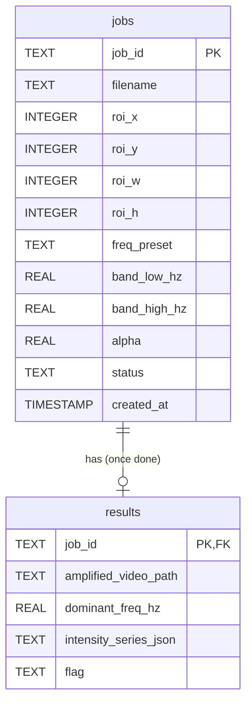

# Database Schema

Storage: plain SQLite via Python's standard-library `sqlite3` module — no
ORM. Database file: `jobs.db`, created relative to wherever the server
process is started from.

## Entity relationship

## `jobs` table

One row per uploaded video. Created at upload time; updated as processing
progresses.

| Column | Type | Set when | Notes |
|---|---|---|---|
| `job_id` | TEXT (PK) | Upload | Random UUID, generated by the API |
| `filename` | TEXT | Upload | Original uploaded filename (not the saved path) |
| `roi_x`, `roi_y`, `roi_w`, `roi_h` | INTEGER | `/roi` call | Region-of-interest box in pixels |
| `freq_preset` | TEXT | `/roi` call | `"engine"`, `"structural"`, or `"custom"` |
| `band_low_hz`, `band_high_hz` | REAL | `/roi` call | Resolved frequency range (from preset or custom values) |
| `alpha` | REAL | `/roi` call | Amplification factor, capped at `MAX_ALPHA` |
| `status` | TEXT | Throughout | `"queued"` → `"processing"` → `"done"` or `"failed"` |
| `created_at` | TIMESTAMP | Upload | Defaults to `CURRENT_TIMESTAMP` |

## `results` table

One row per **completed** job. Only exists once processing finishes
successfully.

| Column | Type | Notes |
|---|---|---|
| `job_id` | TEXT (PK, FK → jobs.job_id) | Links back to the owning job |
| `amplified_video_path` | TEXT | Where the output video was saved |
| `dominant_freq_hz` | REAL | The frequency found by `analyze_vibration` |
| `intensity_series_json` | TEXT | The motion-over-time signal, stored as a JSON string |
| `flag` | TEXT | `"periodic_vibration_detected"` or `"no_vibration_detected"` |

**Note:** `intensity_series_json` stores an array as a JSON *string* inside
a TEXT column (not SQLite's native JSON support) — read with
`json.loads(...)` when retrieving, written with `json.dumps(...)` when
saving. This is a deliberate, simple choice appropriate for this project's
scale.

## Known limitation — foreign key not enforced

The `FOREIGN KEY (job_id) REFERENCES jobs (job_id)` constraint on `results`
is **declared but not actively enforced** — SQLite requires a separate
`PRAGMA foreign_keys = ON` per connection to enforce foreign keys, which
isn't currently set. Not a practical risk at this project's scale (nothing
currently creates orphaned result rows), but worth knowing if asked about
data integrity guarantees.

## `db.py` function reference

| Function | Purpose |
|---|---|
| `init_db()` | Creates both tables if they don't exist. Called on server startup. |
| `create_job(job_id, filename, alpha, low_hz, high_hz, preset, roi)` | Inserts a new job row, `status='queued'` |
| `update_job_roi(job_id, roi, preset, low_hz, high_hz, alpha)` | Updates a job's ROI/frequency/alpha settings |
| `get_job_settings(job_id)` | Returns everything needed to *run* the pipeline: filename, ROI, band, alpha |
| `save_job_result(job_id, video_path, dominant_freq, intensity_series_json, flag)` | Inserts a `results` row and sets `status='done'` |
| `mark_job_failed(job_id)` | Sets `status='failed'` — called from the processing function's error handler |
| `get_job_by_id(job_id)` | Returns status + result info (via `LEFT JOIN`) — used by `/status` and `/result` endpoints |
| `get_all_jobs()` | Returns a summary of every job, newest first — used by `/api/jobs` |

**Why two separate "get" functions** (`get_job_by_id` vs. `get_job_settings`):
they answer two different questions — "what happened to this job" (status/
results, for the API to report back) vs. "what settings should be used to
process it" (for the pipeline to actually run). Keeping them separate
avoids one function trying to serve two different, growing purposes.

## Why raw `sqlite3` instead of an ORM

A deliberate choice for this project's scale — a single job/results table
pair with straightforward relationships doesn't need the abstraction layer
an ORM (like SQLAlchemy) provides. Raw SQL with `?` placeholders (used
throughout `db.py`) is simpler to read end-to-end and is already
injection-safe, since placeholders are properly parameterized rather than
using string formatting to build queries.
