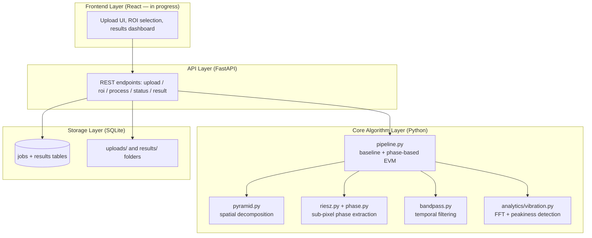
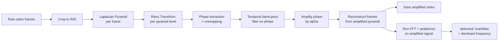
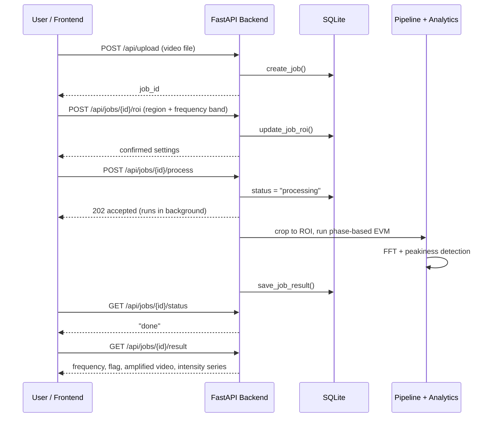

# System Architecture

## Overview

This system takes a video, amplifies motion that's invisible to the naked
eye, and then mathematically verifies whether that motion is a genuine,
periodic vibration — not camera shake, sensor noise, or a coincidence.

It's built in four layers, each with a single clear responsibility:



## Why this layering

- **Core algorithm layer has zero knowledge of the web/API/database.** Every
  function in `core/` and `analytics/` takes plain NumPy arrays in, returns
  plain NumPy arrays or dictionaries out. This was deliberate — it's what let
  us test and validate the entire algorithm using standalone scripts and
  synthetic test clips, completely independent of the API ever existing.
  The API layer is a thin wrapper around this, not the other way around.
- **The API layer's only job is: accept HTTP requests, validate them, call
  the core layer, store/return results.** It contains no signal-processing
  logic of its own.
- **The storage layer is intentionally simple** — plain SQLite via the
  standard-library `sqlite3` module, no ORM. Appropriate for a hackathon
  prototype's job/results tracking; would need to be reconsidered (e.g.
  PostgreSQL) for concurrent multi-user production use.

## Processing pipeline, in detail



**Key design decision — crop to ROI *before* running the pipeline, not
after.** Two reasons: (1) it directly matches the requirement that
processing runs "on the selected region of interest," and (2) cropping
first means every downstream computation (pyramid, Riesz transform, FFT)
only ever runs on a small region instead of a full frame — this is what
keeps processing time low.

**Key design decision — detect vibration on the *amplified* signal, not the
raw upload.** Our band-pass filter (baked into the amplification step)
suppresses out-of-band noise (e.g. video codec compression artifacts) and
boosts the real signal before detection ever runs. Testing showed this
matters a lot: the same footage that failed detection when analyzed raw
succeeded once run through amplification first. See
[`../ml/vibration-analysis.md`](../ml/vibration-analysis.md) for the full
investigation.

## Request/response flow



Processing runs as a **background task** (FastAPI's `BackgroundTasks`), not
inline in the request — this is important: our pipeline takes several
seconds even on small test clips, and blocking the whole server on one
request would make it unresponsive to everyone else while processing.

## Tech stack and rationale

| Layer | Technology | Why |
|---|---|---|
| Core algorithm | Python, NumPy, OpenCV, SciPy | Fast array math, image pyramids, trusted/well-tested signal filtering (Butterworth, FFT) |
| Backend API | FastAPI, Uvicorn | Async-friendly, auto-generates interactive API docs, minimal boilerplate |
| Storage | SQLite (`sqlite3`, no ORM) | Lightweight, zero-config, sufficient for a job/results table at this scale |
| Frontend | React *(in progress)* | Upload UI, ROI drawing, results dashboard |

## Project structure

```
motion-amp-sih/
├── backend/
│   ├── requirements.txt
│   └── app/
│       ├── main.py              # FastAPI app — all API endpoints
│       ├── config.py            # frequency presets, alpha limits, folders
│       ├── db.py                # SQLite storage layer
│       ├── core/
│       │   ├── pyramid.py       # Laplacian pyramid (spatial decomposition)
│       │   ├── bandpass.py      # Butterworth temporal filter
│       │   ├── riesz.py         # Riesz transform pair
│       │   ├── phase.py         # phase/amplitude extraction
│       │   └── pipeline.py      # baseline + phase-based EVM, wired together
│       ├── io/
│       │   └── video_io.py      # video file <-> NumPy array
│       └── analytics/
│           └── vibration.py     # FFT vibration detection + peakiness test
├── test_clips/
│   └── generate_test_clips.py   # synthetic ground-truth test videos
├── docs/                        # this documentation
└── frontend/                    # React UI (in progress)
```
